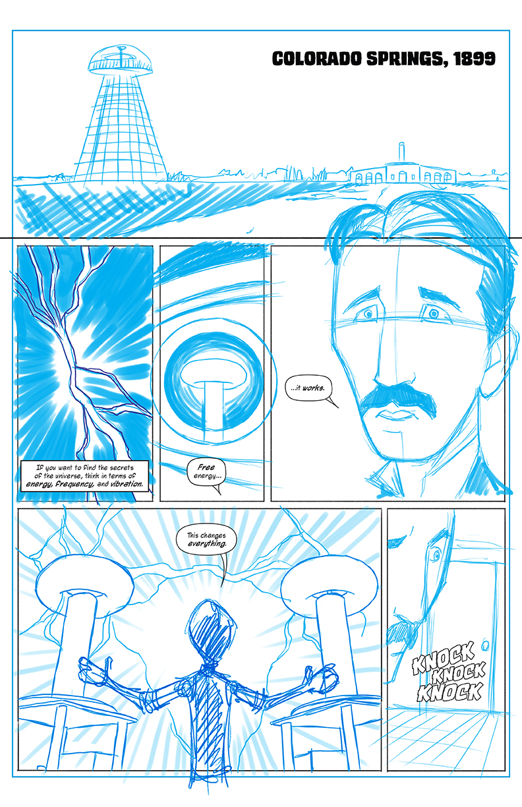

# THE NODE CHRONICLES
### *Volume 1*

## **PREFACE**

Here's what I'd like for you to do for me:

> Make me laugh. Make me cry. Tell me my place in the world. Lift me out of my skin and place me in another. Show me places I have never visited and carry me to the ends of time and space. Give my demons names and help me confront them. Demonstrate for me possibilities I've never thought of and present me with heroes who will give me courage and hope. Ease my sorrows and increase my joy. Teach me compassion. Entertain and enchant and enlighten me. 

Tell me a story. 

**CHAPTER DETAILS**

TBD - FRANCHINO

| PAGES |
| -- |
| SPLASH PAGE | See Below |
| PAGE 1 | See Below |
| PAGE 2 | See Below |
| PAGE 3 | See Below |

&nbsp;

| CREDITS |
| -- | -- |
| Writer | Franchino |
| Artist | Colbert |

PAGE 1

**FIRST SPLASH PAGE**

This is still a work in progress - splash page should act as a second cover for the journey ahead. 

> Talk is cheap in the 21st century. You either got what it takes or you don't. Only the skilled will survive.

**IDEA #1: **Outline of the PI board acts as the surrounding frame of the illustration where the world is becoming of age and only the strong are left standing.

---

> Welcome to the Node Chronicles. This is a journey into the world of **Electrical Computer Engineering**, the most interesting field known to man. 

---

| Objectives of Opening Words |
| -- |
| Take reader to the very beginning of modern electricity and alternating currents |
| Explain the Field of ECE as it exists today |
| Show examples of what's possible when you master this field |
| Explain or demonstrate how the book is going to work |

---

THE INTRODUCTION CHAPTER
## The Forefathers of ECE

PAGE 2 & 3

** THE NODE CHRONICLES INTRO: **  Nicola Tesla, creator of the alternating current is muscled and destroyed.

> **PANEL ONE** - PULL BACK FROM PREVIOUS IMAGE AND SHOW THE IMAGE OF THE TESLA COIL THROUGH THE CORNEA OF NICOLA TESLAS EYE. NO DIALOGUE.

* **1 CAP:** If you want to find the secrets of the universe, think in terms of energy, frequency and vibration.

> **PANEL TWO** - PULL BACK FURTHER TO SHOW NICOLA TESLAS FACE, WIDE EYED AS HE JUST WITNESSES WIRELESS ELECTRICITY WORKING FOR THE FIRST TIME.

* **2 TESLA:** ...free energy...
* **3 TESLA:** ...it works...

> **PANEL THREE** - PULL BACK EVEN FURTHER TO SHOW THE INFAMOUS TESLA COIL AND SPECTACULAR SHOW OF ELECTRICITY. YOUR CALL ON HOW TESLAS FULL FIGURE FITS INTO THIS PANEL.

* **4 TESLA:** ...this changes everything, again...

> **PANEL FOUR** - A STRONG KNOCK AT THE DOOR, SOMEONE IS THERE TO SHUT TESLA DOWN, AGAIN. HE HAD ALREADY HAD HIS TOWER OF DREAMS AND PATENTS SHUT DOWN AND STOLEN BY JP MORGAN.

* **5 POLICE:** Tesla, open the door, we know you're in there. You were told to cease and desist.

* **SOUND:** CRAAAK--THUMPPPP

* **6 TESLA:** You're making a mistake. The world needs this. We will destroy our planet without it. 

> **PANEL FIVE** - THE DOOR IS KICKED IN AS A CREW OF POLICE RUSH THE OLD APARTMENT WHERE TESLA HAS BEEN TESTING HIS FREE WIRELESS ENERGY SYSTEM. BEHIND THE POLICE OFFICERS STANDS A MAN IN THE SHADOWS WHO IS PRESUMED TO BE JP MORGAN JR, WHO IS CONTROLLING THE COPS. JP IS WEARING A LONG COAT, TOP HAT, CANE AND HAS A SHINY GOLD POCKET WATCH.

* **7 JP MORGAN:** I got you're letter. Did you think you could undermine my family? 
* **8 TESLA:** How could you, these are my ideas, electricity should be free, its not yours to control!

> **PANEL SIX** - TESLA IS LEFT CRUSHED, HIS IDEAS, STOLEN AND CRUSHED, HE HAS BEEN DEFEATED. SEVERAL YEARS PRIOR HIS TOWERS WERE DESTROYED BY THE GOVERNMENT UNDER THE JP MORGANS INSTRUCTIONS. THE COPS AND JP MORGAN HAVE RAIDED THE APARTMENT, DESTROYED EVERYTHING AND LEFT TESLA GRIEVING FOR HE KNOWS HE WILL NEVER BE ABLE TO SUCCEED WITH FREE ENERGY.

* **9 TESLA, WHISPER:** The present is theirs; the future, for which I really worked, is mine. 
* **10 CAP:** The day science begins to study non-physical phenomena, it will make more progress in one decade than in all the previous centuries of its existence. 

CURRENT BLUE LINES

| REFERENCES |
| -- |
| [Images of Nicola Teslas Inventions](http://www.teslasociety.com/tesla_tower.htm) |
| [Letter from Nikola Tesla to J. P. Morgan, Jr., 10 January 1916](http://www.themorgan.org/collection/archives/item/letter-from-nikola-tesla#) | 

---
**Segway to the Alan Turing section:**

Meanwhile, almost 40 years later, Alan Turing was prosecuted in 1952 for homosexual acts, when such behaviour was still ****a criminal act in the UK. He accepted treatment with DES (chemical castration) as an alternative to prison. 

Turing died in 1954, 16 days before his 42nd birthday, from cyanide poisoning. An inquest determined his death as suicide, but it has been noted that the known evidence is equally consistent with accidental poisoning.

In 2009, following an Internet campaign, British Prime Minister Gordon Brown made an official public apology on behalf of the British government for "the appalling way he was treated". Queen Elizabeth II granted him a posthumous pardon in 2013.

---
PAGE 4 & 5

** THE NODE CHRONICLES INTRO: **  Alan Turing, creator of the Turing Machine (the modern computer) is castrated and poisoned for being gay.

> **PANEL ONE** - ALAN TURING IS BEING ABUSED IN AN INSANE ASYLUM, HE IS WEARING A STRAIGHT JACKED AND BEING TAKEN TO THE PLACE WHERE HIS BALLS WILL BE CASTRATED. He IS SEEN THROUGH THE SMALL FACE PANEL OF THE DOOR FOR THE INSANE ASYLUM HE IS IN.

* **1 CAP:** We are not interested in the fact that the brain has the consistency of cold porridge.

* **2 WARDENS ASSISTANT:** Let's go Alan, it's your turn.

> **PANEL TWO** - THE WARDENS ASSISTANT RIPS THE MASK OFF HIS FACE.

* **3 ALAN:** No, please, you don't understand.

> **PANEL THREE** - A CLOSE UP OF THE WARDENS FACE AS HE SENTENCES ALAN TO HIS CASTRATION.

* **4 WARDEN:** It's quite the shame. Inventor of the computer, a queer.

> **PANEL FOUR** - A CLOSE UP ALAN TURINGS SWEET FACE. HE IS A NICE MAN, NEVER HURT ANYONE. HE IS FRIGHTENED AND HAS BEEN TREATED LIKE AN ANIMAL.

* **5 ALAN:** I'm a human being, you can't do this to me!!!

> **PANEL FIVE** - ALAN IS DRAGGED AWAY PAST MULTIPLE INSANE PEOPLE ON THE FLOORS, CHAINED TO WALLS LIKE CAGED ANIMALS. HE IS TAKEN TO BE CASTRATED.

* **6 ALAN:** Please, don't do this to me. It's not my fault!

* **7 CAP:** We can only see a short distance ahead, but we can see plenty there that needs to be done.

| REFERENCES |
| -- |
| [ALAN TURING MOVIE SCENE](http://cdn.thedailybeast.com/content/dailybeast/articles/2014/11/29/the-castration-of-alan-turing-britain-s-code-breaking-wwii-hero/jcr:content/image.img.2000.jpg/1417261521198.cached.jpg) |

**HISTORICAL FIGURES CAST**

* Nicola Tesla
* Thomas Edison
* Alan Turing
* John Bardeen
* Jack Kilby
* Add 2 females
* Add 2 males

*Each volume will reveal more about each of the historical figures*

Time-line A Highlights: [See Full UOI Timeline](http://www.ece.illinois.edu/about/history/#1800)

> 2014 - Associate Professor Gabriel Popescu uses [white-light diffraction tomography](http://www.nature.com/nphoton/journal/v8/n3/images_article/nphoton.2013.350-f4.jpg) to capture 3-D images of cells with no dyes. This means the cells remain alive, allowing researchers to study them in three dimensions over time. As a result, researchers can observe how cells respond to specific drugs or treatments.

> 1972 - Electrical engineering and physics Professor [John Bardeen receives](http://www.famousinventors.org/images/john-bardeen.jpg) his second Nobel Prize in physics, this time for co-developing the theory of superconductivity with J. Robert Schrieffer and Leon Cooper. Bardeen had won his first Nobel in 1956 for co-inventing the transistor.

> 1958 - UOI ECE alumnus Jack Kilby (BSEE '47) invents the [integrated circuit](https://upload.wikimedia.org/wikipedia/en/4/42/Kilby_solid_circuit.jpg) while working at Texas Instruments in Dallas.

> 1890's - Tesla invented electric oscillators, meters, improved lights and the high-voltage transformer known as the Tesla coil. He also experimented with X-rays, gave short-range demonstrations of radio communication two years before Guglielmo Marconi and piloted a radio-controlled boat around a pool in Madison Square Garden. Together, Tesla and Westinghouse lit the 1891 World’s Columbian Exposition in Chicago and partnered with General Electric to install AC generators at Niagara Falls, creating the first modern power station. 

> 1889 - General Electric organizes the first modern research-and-development laboratory. Edison begins work on a storage battery for use in electric cars.

*Revise this timeline to be more general and include the historical figures listed above*

| Section Feedback |
| -- |
| How well does it explain modern ECE physics? |
| Is the tone tongue-in-cheek or abstract? |
| Do you have other examples from other Universities? |
| Can you clearly explain or diagram the field of ece? |

---

PRESENT DAY

PAGE 6, 7, 8, 9

** THE NODE CHRONICLES INTRO: ** Gou and his brother Nōn are having a mixed conversation in their secret basement headqaurters about their father, hacking and some of the cool stuff Gou's been setting up around the house. You get a sense for what sorts of projects Gou's working on and his relationship with his father and siblings.

---

> **NOTE TO ARTIST** The next set of pages and panels are loosley formatted - we may need an extra page or two or we may be able to combine some of these panels. Be sure to review and provide feedback before jumping into doing the bluelines for this section.

---

PAGE 6

> **PANEL ONE** - THE FIRST OF A SERIES OF REVEALING SHOTS GOING FROM FAR TO NEAR, OF GOU AND NON IN THEIR HIGHLY SECRETIVE BASEMENT HEADQUARTERS, A SECTION OF THE BASEMENT HIDDEN BEHIND A SECRET WALL COVERED IN OLD BOXES AND JUNK. ONLY THE TWO BROTHERS AT THIS POINT KNOW ABOUT THIS PLACE. SEE REFERENCES OF WHAT THIS BASEMENT COULD LOOK LIKE BELOW.

* **1 CAP:** TBD explain the location and significance of the basement headquarters of BHQ as Nōn somtimes puts it.

> **PANEL TWO** - CLOSER TO THE BOYS...

> **PANEL THREE** - CLOSER...

PAGE 7

> **PANEL ONE** - FULL PAGE PANEL. GOU IS FIXATED ON A HIGHLY EXPIRAMENTAL PROJECT. IF IT WORKS, HE'LL MAKE A TON OF MONEY MINING FOR BITCOIN. HE'S TRYING TO SEE IF HE CAN RETROFIT OLD DESKTOP POWER SUPPLIES WITH RODIN COILS. WE SEE GOU TRIAGING OUT THE EXISTING COPPER COILS AND EXAMINING THEM UNDER A LIGHT. HE'S TAKING A HUGE RISK BY DOING THIS IN HIS BASEMENT, AS HE'S BEEN FORBIDDEN TO HACK ON COMPUTERS BY HIS FATHER. IN THIS PANEL, WE SEE A CLOSEUP OF GOU'S FACE AND THE INTERNAL WIRING OF THE POWER SOURCE AS HE SNIPS THE TWO WIRES CONNECTING THE EXISTING COPPER COIL TO THE BASE OF THE BATTERY. SEE REFERENCE MATERIALS BELOW FOR IMAGES OF THE INSIDE OF A POWER SOURCE AND A RODIN COIL.

* **1 CAP:** Swarn to be a normal boy and not to get caught up in computers and technology, Gou Sokyeo taught himself the art of electrical computer engineering against his fathers wishes. 

PAGE 8

> **PANEL ONE** - FIRST EVER LOOK AT NON, GOU'S BROTHER. HE'S BOUNCING A MINI SOCCER BALL OFF THE WALL BESIDE GOU, POSSIBLY SITTING IN A CHAIR HE'S TIPPING BACK. 

* **2 Nōn:** What's dad so against technology anyhow? And why are you salvaging these old coils? 

> **PANEL TWO** - GOU RESPONDS TO NON WITHOUT ALLOWING HIMSELF TO BE DISTRACTED. AS HE WORKS ON CLIPPING OUT THE CURRENT COPPER COIL FROM THE POWER SUPPLY, HE RESPONDS TO NON VERY CASUALLY, AS IF BARELY PAYING ATTENTION TO WHAT NON HAS TO SAY. A CUTE KID, HE'S WEARING A SOCCER JERSEY AND IS CLEARLY MORE OF A JOCK.

* **3 Gou** I dunno. I think he doesn't want me to grow up to fast... that and I think something happened to him in the field just before he went on his sabbatical. And I'm replacing the coils with Rodin coils. Trying something...

> **PANEL FOUR** - NON STOPS BOUNCING THE BALL AS IF HE'S INTENTIONALLY LEFT IT ROLL AWAY AS HE FACES GOU. HE LOOKS CONCERNED AND NERVOUS FOR GOU AS HE TRIES TO WARM HIM. BUT GOU DOESN'T SEEM TO BE QUITE AS CONCERNED.

* **4 Nōn** You know if he catches you down here with all this stuff he's gonna kill you.

> **PANEL FIVE** - BALL ROLLS AWAY. 

> **PANEL SIX** - GOU HOLDS UP THE HC-SRO4 SONAR SENSOR AND EXPLAINS TO NON THAT HE'S IMPLEMENTED HIS OWN SECURITY SYSTEM. 

* **5 Gou** I got eyes and ears on him all the time. You see this sonar sensor? If he even comes near the basement door upstairs I'll know. 

* **6 CAP** Disguised as a normal thirteen year old boy, he is one of most elite ECE hackers in the world. From his secret basement headquarters in Garfield Park, he takes part in the most innovative programming and engineering projects known to man. 

> **PANEL SEVEN** - INTENTIONALLY BLANK

* **7 Nōn** The guys a couch potatoe.

PAGE 9

> **PANEL ONE** - TBD

* **1 Gou** You know Vero said he wasn't always a bum, and that one day he completely changed, almost as if he gave up on life.

> **PANEL TWO** - TBD

* **2 Nōn** Where's Lilu? 

> **PANEL THREE** - TBD

* **3 Gou** She's out flying the drone I built her. Check it out, I can see whatever the drone sees. 

* **4 CAP** TBD

> **PANEL FOUR** - TBD

* **5 Nōn** That's fricking crazy! You did that with the PI zero? 

* **6 Gou** Yep.

> **PANEL FIVE** - TBD

* **7 Nōn** How are you transmitting the footage? 

> **PANEL SIX** - TBD

* **8 Gou** Using a Particle Electron, they sent me one to test. It's got a Ublox chip that gives me 3G access. Pretty much works anywhere a phone works. 

* **9 CAP** TBD

* **9 Nōn** Dope. You gonna use that for the near space weather balloon project? 

> **PANEL SEVEN** - TBD

* **10 Gou** Pier 19 baby. Disrupt. Still need to figure out how to insulate everything. It get's pretty cold up there. 

> **PANEL EIGHT** - TBD
* **11 Nōn** You're crazy. You're gonna get in serious trouble. 

* **12 CAP** TBD

PAGE 10

> **PANEL ONE** - TBD

* **SOUND** Blip. Blip Bleep. 

* **1 Gou** Crap someones coming. Jinx, open terminal. Jinx, turn on camera eight.

> **PANEL TWO** - TBD

* **2 Gou** Ugh it's Lilu. Nevermind. Go get her and bring her upstairs, tell her I'll look at the drone in a bit to go do something else.

* **3 CAP** TBD

> **PANEL THREE** - TBD

* **4 Nōn** What do I look like? 

* **5 Nōn** Fine... I'll do it, but you owe me. We're playing soccer later. For an hour.

* **6 CAP** TBD

| REFERENCE MATERIALS |
| -- |
| [Some basement inspiration](https://problemspaces.slack.com/archives/artists_and_animators/p1453769635000006) |
| [Previous bluelines of Gou working on old Power Supplies](https://problemspaces.slack.com/files/asrigallarts/F0KETA1EE/pasted_image_at_2016_01_26_02_34_pm.png) |
| [Coil Extraction Sketch](https://problemspaces.slack.com/files/franchino/F0KJS67KM/slack_for_ios_upload.jpg) |
| [A photo of an actual power supply's guts](https://problemspaces.slack.com/files/franchino/F0KC6BC1E/slack_for_ios_upload.jpg) |

---

ADDITIONAL INTRODUCTION RESEARCH

## The New Democratizers

**SPECIAL GUEST CAST**

* Lady Ada
* Massimo Bansi
* Elon Musk
* Neil Tyson DeGrasse
* Michio Kaku
* RASP PI CREATOR
* 5 more people

> One of the not-so-obvious side benefits of the miniaturization of electronics is that folks far removed from the realm of electronic engineering become comfortable with small electronic devices and think, “Wouldn’t it be neat if I had a [gizmo] that did…?” Back when computers were called “workstations” their inner workings seemed mysterious, complex, and expensive, and few consumers thought about how they could exploit the computational power. But now that the equivalent of a workstation fits into a hand-sized smartphone complete with a rechargeable power source and a high-definition screen,  software creation is appealing to a non-technical audience. There’s an app for seemingly everything, and even 10-year olds are creating them.

[Artile on Democratization of Hardware](http://www.edn.com/electronics-blogs/powersource/4311918/Adafruit-Sparkfun-point-to-the-democratization-of-hardware)

[Next Web Article on Dem. of Hardwrae](https://thenxtbet.wordpress.com/2014/03/26/is-democratization-of-hardware-the-next-big-wave-in-smartphones/)

## The big corporations that revolutionized everything else

* INTEL
* IBM
* APPLE
* MOTOROLA
* Add 2 others

## A brief history of software and operating systems

* Linux
* Windows
* OSX

## The Main Cast

* Gou Sokyeo
* Nōn Sokyeo
* Lilu
* Chino Sokyeo
* Vero
* Michio
* Ladybug
* Lisa
* Bonner
* Ophir
* Eric "Lefty" Kaufman
* Brad Balder
* Anonymous

