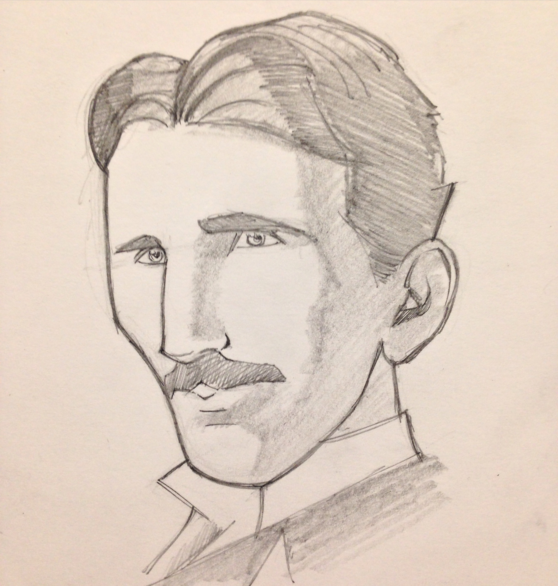

# THE NODE CHRONICLES
### *Volume 1*


## **PREFACE**


Here's what I'd like for you to do for me:

> Make me laugh. Make me cry. Tell me my place in the world. Lift me out of my skin and place me in another. Show me places I have never visited and carry me to the ends of time and space. Give my demons names and help me confront them. Demonstrate for me possibilities I've never thought of and present me with heroes who will give me courage and hope. Ease my sorrows and increase my joy. Teach me compassion. Entertain and enchant and enlighten me.  Tell me a story. 

**PREFACE**

The Node Chronicles started up because of the numerous failed attempts I had at getting my own kids interested in computer science. 

What started as an expirament at infusing fundamentals with rich graphics has now become a globally recognized platform used by teachers, parents and young innovators everywhere.

Now that I've been able to form a company, research has become forensic. Our resaerch teams goal is to prove just how 'educational content' mixed with 'comic book action and illustration' helps kids memorize important engineering concepts. 

Does a young newb (or even an adult) retain information differently with this format? What's unique about it compared to plain text or video? How often before a reader returns to the material without being pressured? Does this format help draw kids in over their other devices?

Gamifyed is the first mover to go full-speed ahead with this idea. With the help of former Marvel artists, DC writers and top ECE practicioners our goal is to genuinely inspire and teach young readers using a carefully stitched together technical literature, tutorials, action, movement, suspense, drama, politics, hardships and real-world scenarios. Gamifyed wants this to be the book you can't put down; the path to some serious techno enlighment, a segway to some serious hacking abilities.

Editors of this book are often shocked at the some of direction I've taken as a writer; whether it be how I'm using the word 'hacker' or how I've chosen to depict the industry. They say to themselves, "but this is for kids, we can't possibly use the word crap or talk about torture, failures and nightmare situations in an educational text book!"

I disagree. This book isn't necessarily for toddlers either. The book is meant to attract teenagers before it's too late. It's also meant to be refreshingly honest. Actually I think that this sort of edge could be what very well ends up aiding in my ultimate goal; to be the best book for grasping the field of ECE.

It just so happens that when I looked back at the history of ECE I found it fascinating how so many of the pioneers of modern science and computing we're persecuted, discouraged, lied to and so on. In a nutshell, the field is all about competition. Communication, politics and street smarts are just as important as being a geek.

To be specific, Alan Turing, the inventor of the modern computer was castrated for being gay in the UK in the 1950's. Tesla was sabotaged by JP Morgan and his son, even DaVinci lived in fear so he wrote his notes backwareds. Infact, the list of scientests who've been persecuted reads like the who's who of science: Copernicus, Bruno, Galileo, Descartes, Newton, Halley, Darwin, Hubble, even Bertrand Russell. 

All this drama and sacrafice makes for some rich inspiration for what we need as authors of a graphic novel: bad guys, hardships, horror, adventure, movement and so forth.  

I want to make kids feel like their fighting for something, that their backs are up against the wall and that ECE is a tool for survival. In some ways, I want to go where no textbook has ever gone before.

As another possible example, right now in San Francisco, in the year 2016, the city is practically at a techno civil war amongst those who make big money and those who work regular blue collar jobs. The blue collar employees are sick of the techno what-nots and their arrogant attitudes and inflated cost of living. The blue collar workers have even abandoned all technology and will go as far as to ridicule the computer geeks who walk the streets. 

And let's not forget the movie 'Big Hero 6' starts off in an illegal robot gambling ring, a main character who's parents and brother die and the entire plot is based on deceit and corrupt power from investors and even the education system itself.

I'll often tell my students after watching clips of the movie 'The Martian' that Mark Watney survies on Mars only because of his advanced knowledge of ECE and Science.

I do draw the line however in some spots. I'm not interested in teaching about sex, drugs or in making the main characters negatively opinionated about religion, sexual orientation or violence. I believe that some things should remain a mystery for kids as well.

In a recent interview of a 18 year old Univeristy of Illinois sophmore ECE major it was noted that 'pointers' in programming had repetedly haunted him since the day he overheard his father fiercely arguing with his apprentice about their significance. Pointers are a really complex subject in low-level programming. It wasn't until 6 years later that Rushi had conquered them and it was if he had a vendetta against them. Seventeen is a really early age to understand 'pointers' in the way Rushi had, and it was because each year and from time to time, he would revisit them, trying each time to comprehend them until one day on an impossible project at school it just clicked.  

Passing down a careful blend of must know topics tied to dramatic situations is what makes this format so unique to me. I can do with it what regular text books have never been able to and I can re-create these moments with intense illustrations and action. Major textbook publishers would never dare mix controversial values, deep politics and grit with learning - let alone comic books. And I don't disagree. School isn't a place for super off topic, expiramental indy written content by enlarge. But the general curriculum also isn't a place for developing prodigies now is it?

And that's what this book is really about: the 'missing curriculum' - it's about not letting our kids get any older without understanding certain things and what it means to be equipped with the power of ECE. The young mind is powerful, kids exhibit extreme memory and learning capabilities when they play video games or sports.

So I digress; If you're looking for something less gritty, try Kano or the Manga Guides. If you're looking for something seriously hardcore that's built from the ground up with careful research, something that can genuinely build a real interest, choose Gamifyed and The Node Chronicles. 


** Target Audience**

The simple answer is 9 to 19 year olds.

The more complicated answer is: almost everything Gou and his friends demonstrate in this book can be repeated by the reader. The book features a ton of QR code code extended content, open source code snippets and a flagship feature, expansion packs. Expansion Packs are physical kits that go along with each chapter. The goal is to offer reasonably priced, a la carte hardware packs to give readers the real-world hands on experience they need to succeed in this field. In the tech industry, it's all about what you have done and demonstrating tangible abilities - so let's not be hasty here. Anyone capable of reading a comic book will benefit from this book.
  

** Beta Feedback **

At the time of this writing in 2016 I'd still consider this all to be quite expiramental. Soon however, this won't be the case, it will either be considered an epic failure, show negligible improvement or dramatically improve the way newbs pick this stuff up. I'm hoping for the later, for everyones sake.

It's going to be an ongoing endeavor for my company to know these things. To help support our research we encourage observers, teachers and parents who have provided this opportunity for their kids to keep a close eye on readers and report back to us what you're finding. At it's core, the entire novel is built ontop of a cohesive series of lessons on the Raspberry PI, Arduino, circuitry, programming, the Internet and dozens of scientific sensors. The creative portion tends to be inspired by historical events, realistic situations or the inevitable.


| PAGES |
| -- |
| PAGE 0 & 1 | Inside cover and Splash Page |
| PAGE 2-5 | Tesla, Draft Complete |
| PAGE 6-10 | Turing, Draft Complete |
| PAGE 10-20 | Gou & Nōn Establishing Scene @ the Basement Headquarters |

&nbsp;

| CREDITS |
| -- | -- |
| Writer | Franchino |
| Artist | Colbert |

PAGE 1

**FIRST SPLASH PAGE**

This is still a work in progress - splash page should act as a second cover for the journey ahead. The intro chapter covers 2 important historical figures and then cuts to modern day, Gou and Non at the BHQ (The Basement Headquarters).

> Talk is cheap in the 21st century. You either got what it takes or you don't. Only the skilled will survive.

**IDEA #1: **Some collage of Tesla and the cops, the Warden and Turing and Non and Gou at the center of it all... Gou's father perhaps as well, who would appear to be their major antagonist, who later is revealed to be Gou's best resource and partner.


---


> Welcome to the Node Chronicles. This is a journey into the world of **Electrical Computer Engineering**, the most interesting field known to man. 

---

| Objectives of Opening Words |
| -- |
| Take reader to the very beginning of modern electricity and alternating currents, a brief history of ECE |
| Explain the Field of ECE as it exists today, where we stand |
| Show examples of what's possible when you master this field, show some really cool inventions early on |
| Explain or demonstrate how the book is going to work, give a taste of the types of project, action and how a reader should behave or what they will do throughout the book. |

---

THE INTRODUCTION CHAPTER
## Stealth Mode

PAGE 2-6

** THE NODE CHRONICLES INTRO: **  Nicola Tesla, creator of the alternating current is muscled and destroyed by JP Morgan Jr (who's there to finish the job his father started).



> **PANEL ONE** - PULL BACK FROM PREVIOUS IMAGE AND SHOW THE IMAGE OF THE TESLA COIL THROUGH THE CORNEA OF NICOLA TESLAS EYE. NO DIALOGUE.

* **1 CAP:** If you want to find the secrets of the universe, think in terms of energy, frequency and vibration.

> **PANEL TWO** - PULL BACK FURTHER TO SHOW NICOLA TESLAS FACE, WIDE EYED AS HE JUST WITNESSES WIRELESS ELECTRICITY WORKING FOR THE FIRST TIME.

* **2 TESLA:** ...free energy...
* **3 TESLA:** ...it works...

> **PANEL THREE** - PULL BACK EVEN FURTHER TO SHOW THE INFAMOUS TESLA COIL AND SPECTACULAR SHOW OF ELECTRICITY. YOUR CALL ON HOW TESLAS FULL FIGURE FITS INTO THIS PANEL.

* **4 TESLA:** ...this changes everything, again...

> **PANEL FOUR** - A STRONG KNOCK AT THE DOOR, SOMEONE IS THERE TO SHUT TESLA DOWN, AGAIN. HE HAD ALREADY HAD HIS TOWER OF DREAMS AND PATENTS SHUT DOWN AND STOLEN BY JP MORGAN.

* **5 POLICE:** Tesla, open the door, we know you're in there. You were told to cease and desist.

* **SOUND:** KNOCK, KNOCK, KNOCK

* **6 TESLA:** You're making a mistake. The world needs this. We will destroy our planet without it. 

> **PANEL FIVE** - THE DOOR IS KICKED IN AS A CREW OF POLICE RUSH THE OLD APARTMENT WHERE TESLA HAS BEEN TESTING HIS FREE WIRELESS ENERGY SYSTEM. BEHIND THE POLICE OFFICERS STANDS A MAN IN THE SHADOWS WHO IS PRESUMED TO BE JP MORGAN JR, WHO IS CONTROLLING THE COPS. JP IS WEARING A LONG COAT, TOP HAT, CANE AND HAS A SHINY GOLD POCKET WATCH.

* **SOUND:** CRAAAK--THUMPPPP

* **7 JP MORGAN:** I got you're letter. Did you think you could undermine my family? 

* **8 TESLA:** How could you, these are my ideas, electricity should be free, its not yours to control!

> **PANEL SIX** - TESLA IS LEFT CRUSHED, HIS IDEAS, STOLEN AND CRUSHED, HE HAS BEEN DEFEATED. SEVERAL YEARS PRIOR HIS TOWERS WERE DESTROYED BY THE GOVERNMENT UNDER THE JP MORGANS INSTRUCTIONS. THE COPS AND JP MORGAN HAVE RAIDED THE APARTMENT, DESTROYED EVERYTHING AND LEFT TESLA GRIEVING FOR HE KNOWS HE WILL NEVER BE ABLE TO SUCCEED WITH FREE ENERGY.

* **9 TESLA, WHISPER:** The present is theirs; the future, for which I really worked, is mine. 

* **10 CAP:** The day science begins to study non-physical phenomena, it will make more progress in one decade than in all the previous centuries of its existence. 

CURRENT BLUE LINES


| REFERENCES |
| -- |
| [Images of Nicola Teslas Inventions](http://www.teslasociety.com/tesla_tower.htm) |
| [Letter from Nikola Tesla to J. P. Morgan, Jr., 10 January 1916](http://www.themorgan.org/collection/archives/item/letter-from-nikola-tesla#) | 

---
**Segway to the Alan Turing section:**

Meanwhile, almost 40 years later, Alan Turing was prosecuted in 1952 for homosexual acts, when such behaviour was still ****a criminal act in the UK. He accepted treatment with DES (chemical castration) as an alternative to prison. 

Turing died in 1954, 16 days before his 42nd birthday, from cyanide poisoning. An inquest determined his death as suicide, but it has been noted that the known evidence is equally consistent with accidental poisoning.

Alan Turing invented the turing machine to crack Nazi code generated by their infamouse Enigma Machine. By deciphering encrypted messages captured over the air waves, Turing helped the opposition learn the Nazi's plans and positining for attack. The turing machine would later become the premise of every modern computer. Finite State Machines are what interprets the binary system of all mainstream hardware and operating systems to this very day. He is considered one of the most significant inventors of the 20th century. 


---
PAGE 7-10

** THE NODE CHRONICLES INTRO: ** Meanwhile, almost 40 years later, Alan Turing creates the Turing Machine which helps the opposition win the war against the Nazis. It becomes the premise of all modern computing. 

#### Turing PART 1

First part must talk about the turing machine and what he created and how he used it to defeat the Nazis. 

```TODO: MISSING 2 MORE PAGES FOR TURING SECTION, 4 TOTAL NOW```

| REFERENCES |
| -- |
| [How a Turing Machine Works](https://www.youtube.com/watch?v=dNRDvLACg5Q) |
| [The Turying Full Story in under 2 minutes](https://www.youtube.com/watch?v=EhDBJ7Mym3I) | 

#### Turing PART 2

Alan Turing was unjustly prosecuted in 1952 for what most people today do not regard as a criminal act.  Turing accepted an alternative, yet far more barbaric sentence rather than prison.

> **PANEL ONE** - ALAN TURING IS BEING ABUSED IN AN INSANE ASYLUM, HE IS WEARING A STRAIGHT JACKED AND BEING TAKEN TO THE PLACE WHERE HE WILL BE CASTRATED (WE DON'T SAY CASTRATED IN THE DIALOGUE, BUT THIS IS WHAT REALLY HAPPEND TO THE INVENTOR OF THE MODERN DAY COMPUTER). HE IS FIRST SEEN THROUGH THE SMALL FACE PANEL OF THE DOOR FOR THE INSANE ASYLUM HE IS IN.

* **1 CAP:** We are not interested in the fact that the brain has the consistency of cold porridge.

* **2 WARDENS ASSISTANT:** Let's go Alan, it's your turn.

> **PANEL TWO** - THE WARDENS ASSISTANT RIPS THE MASK OFF HIS FACE.

* **3 ALAN:** No, please, you don't understand.

> **PANEL THREE** - A CLOSE UP OF THE WARDENS FACE AS HE SENTENCES ALAN TO HIS PUNISHMENT.

* **4 WARDEN:** It's quite the shame. Inventor of the modern computer, a queer.

> **PANEL FOUR** - A CLOSE UP ALAN TURINGS SWEET FACE. HE IS A NICE MAN, NEVER HURT ANYONE. HE IS FRIGHTENED AND HAS BEEN TREATED LIKE AN ANIMAL.

* **5 ALAN:** I'm a human being, you can't do this to me!!!

> **PANEL FIVE** - ALAN IS DRAGGED AWAY PAST MULTIPLE INSANE PEOPLE ON THE FLOORS, CHAINED TO WALLS LIKE CAGED ANIMALS. HE IS TAKEN FOR HIS PUNISHMENT.

* **6 ALAN:** Please, don't do this to me. It's not my fault!

* **7 CAP:** We can only see a short distance ahead, but we can see plenty there that needs to be done.

| REFERENCES |
| -- |
| [ALAN TURING MOVIE SCENE](http://cdn.thedailybeast.com/content/dailybeast/articles/2014/11/29/the-castration-of-alan-turing-britain-s-code-breaking-wwii-hero/jcr:content/image.img.2000.jpg/1417261521198.cached.jpg) |


**ADDITIONAL HISTORICAL FIGURE CANDIDATES**

* John Bardeen
* Jack Kilby
* Add 2 females
* Add 2 males

*Each volume will reveal more about each of the historical figures*

Time-line A Highlights: [See Full UOI Timeline](http://www.ece.illinois.edu/about/history/#1800)

> 2014 - Associate Professor Gabriel Popescu uses [white-light diffraction tomography](http://www.nature.com/nphoton/journal/v8/n3/images_article/nphoton.2013.350-f4.jpg) to capture 3-D images of cells with no dyes. This means the cells remain alive, allowing researchers to study them in three dimensions over time. As a result, researchers can observe how cells respond to specific drugs or treatments.


> 1972 - Electrical engineering and physics Professor [John Bardeen receives](http://www.famousinventors.org/images/john-bardeen.jpg) his second Nobel Prize in physics, this time for co-developing the theory of superconductivity with J. Robert Schrieffer and Leon Cooper. Bardeen had won his first Nobel in 1956 for co-inventing the transistor.


> 1958 - UOI ECE alumnus Jack Kilby (BSEE '47) invents the [integrated circuit](https://upload.wikimedia.org/wikipedia/en/4/42/Kilby_solid_circuit.jpg) while working at Texas Instruments in Dallas.

> 1890's - Tesla invented electric oscillators, meters, improved lights and the high-voltage transformer known as the Tesla coil. He also experimented with X-rays, gave short-range demonstrations of radio communication two years before Guglielmo Marconi and piloted a radio-controlled boat around a pool in Madison Square Garden. Together, Tesla and Westinghouse lit the 1891 World’s Columbian Exposition in Chicago and partnered with General Electric to install AC generators at Niagara Falls, creating the first modern power station. 

> 1889 - General Electric organizes the first modern research-and-development laboratory. Edison begins work on a storage battery for use in electric cars.

*Revise this timeline to be more general and include the historical figures listed above*


| Section Feedback |
| -- |
| How well does it explain modern ECE physics? |
| Is the tone tongue-in-cheek or abstract? |
| Do you have other examples from other Universities? |
| Can you clearly explain or diagram the field of ece? |


---

PRESENT DAY

PAGE 11-20

** THE NODE CHRONICLES INTERNAL INTRO: ** Gou and his brother Nōn are having a mixed conversation in their secret basement headqaurters about their father, hacking and some of the cool stuff Gou's been setting up around the house. You get a sense for what sorts of projects Gou's working on and his relationship with his father and siblings.

What's more interesting in this chapter is that there's clearly a struggle and pressure. Gou is hiding what he's doing from his father, who when first depicted in the book appears to be an angry man. Almost as if a reincarnation of Tesla, only meaner and more badass. In the first chapter, Gou is caught with one of his hacking devices and his father snaps and rages, much like JP Morgan Jr. does in the first scene. 

While Tesla and Turing had to deal with much worse situations, it reminds us that even today, there is always conflict, there is always something or someone standing in your way. Gou's current conflict with his father (who somewhat even resembles Tesla) is a prelude to a much more dramatic situation towards the end of the book.

Eventually, Gou's father teams up with Gou after snapping out of his funk. This happens once the antagonist role is passed off to the greedy vulture capitalist duo (Brad and Eric) who try and steal Gou's invention using lawyers, shady dealings and politics. Gou's father has no choice at this point to shave, shape up and get in gear and represent the ultimate father and sons family business, something many fathers would love to have and share with their sons.


---

> **NOTE TO ARTIST** The next set of pages and panels are loosley formatted - we may need an extra page or two or we may be able to combine some of these panels. Be sure to review and provide feedback before jumping into doing the bluelines for this section. I'm still waiting on first round of feedback from Colbert.

---

PAGE 11

> **PANEL ONE** - THE FIRST OF A SERIES OF REVEALING SHOTS GOING FROM FAR TO NEAR OF GOU AND NON IN THEIR HIGHLY SECRETIVE BASEMENT HEADQUARTERS. BEHIND THE STAIRCASE AND AROUND THE BEND OF THE LARGE BASEMENT ROOM, A WALL FILLED WITH STORED STUFF EMERGES. DOZES OF HUGE BOXES STACKED TO THE CEILING REVEALSE GLIMSES OF LIGHT FROM THE CRACKS WHERE THE EDGES OF EACH BOX MEET, RESEMBLING THE OUTLINE OF A DOOR BEHIND THE BOXES. THE BOYS HAVE MASKED AN ENTIRE WALL WITH A DOOR AS IF THE BASEMENT ENDED RIGHT THERE (THE LIGHT IS ONLY ON BECAUSE THEY ARE IN THERE WORKING). WHEN THE CORRECT BOX IS MOVED, A HOLE LEADS TO A DOOR, WHICH ONCE ENTERED OPENS UP INTO GOU'S SECRET BASEMENT HEADQUARTERS (BHQ). IT'S HOW THEY GET IN AND OUT. ONLY THE TWO BROTHERS AT THIS POINT KNOW ABOUT THIS PLACE. SEE REFERENCES OF WHAT THIS BASEMENT COULD LOOK LIKE BELOW.

* **1 CAP:** Deep in the cool dark basement lies Gou's the secret headquarters, hidden behind thick cardboard boxes filled with the family's old and unused posessions. 

> **PANEL TWO** - CLOSER REVEAL OF THE TWO BOYS WORKING OUT OF GOU'S STEALTH MODE HEADQUARTERS...

* **2 CAP:** Tis not without strife Gou secretly develops his innovations in stealth mode, for his father Chino does not want him to follow in his footsteps.

> **PANEL THREE** - EVEN CLOSER... UNTIL WE GET RIGHT UP BEHIND THEM AND SEE WHAT GOU'S WORKSTATION AND SETUP LOOKS LIKE. OFF AND AROUND THE AREA ARE PALETS OF OLD PC'S COVERED IN TARPS AND STACKS OF OLD PC POWER SUPPLIES THAT GOU HAPPENS TO BE SALVAGING FOR SOME REASON. THE COMPUTER SCREENS HAVE GECKOBOARDS AND GOU IS CLEARLY MONITORING EVERYTING FROM LATEST BITCOIN STOCK PRICES TO SECURITY CAMERAS AROUND THE PROPERTY. YOU GET THE FEELING THAT IT'S THE START OF A CIA LIKE HEADQUARTER HACKER OPERATION AND THAT THERE IS A TON OF ROOM FOR EXPANSION.

* **3 CAP:** It's no secret that the worlds greatest inventors, from Davinici to Einstein kept their inventions a secret until they were ready. 

* **4 CAP:** By banning Gou from hacking on code and hardware, Chino had inadvertently created one of the youngest stealth mode hackers on the planet.

PAGE 12

> **PANEL ONE** - FULL PAGE PANEL. GOU IS FIXATED ON A HIGHLY EXPIRAMENTAL PROJECT WHICH HE DOESN'T QUITE SHARE WITH THE READER YET (SPOILER ALERT, IT'S THE NODE). GOU'S TAKING A HUGE RISK BY DOING THIS IN HIS BASEMENT, AS HE'S BEEN FORBIDDEN TO HACK ON COMPUTERS BY HIS FATHER. NON COULD GET IN TROUBLE JUST FOR BEING AROUND GOU IT'S THAT DANGEROUS. AND WHILE TOTALLY CHILL MOST OF THE TIME, YOU DON'T WANT TO PISS OFF CHINO, THEIR FATHER. IN THIS PANEL, WE SEE A CLOSEUP OF GOU'S FACE AND NODE.

* **1 CAP:** Swarn to be a normal boy and not to get caught up in computers and technology, Gou Sokyeo taught himself the art of electrical computer engineering against his fathers wishes. 


PAGE 13

> **PANEL ONE** - FIRST EVER SCENE WITH GOU AND NON, THEY ARE INTRODUCED AS A PAIR, ONLY GOU IS CLEARLY THE LEAD HACKER IN THE FAMILY. NON'S JUGGLING A MINI SOCCER BALL (SIZE 1 FUTSAL BALL). AFTER ABOUT 60 JUGGLES HE SMASHES THE BALL WITH HIS RIGHT FOOT AND SMASHES AN OLD UNUSED MONITOR ON THE OTHER SIDE OF THE ROOM THEY ARE IN. NEXT TO HIM IS ARE SEVERAL STACKS OF OLD POWER SUPPLIES THAT HAVE BEEN RIPPED OUT OF A BUNCH OF OLD PCS. THE PCS ARE IN ANOTHER HUGE PILE, COVERED UP BY A TARP, JUST IN CASE.

* **Sound:** Pap, pap, pap, pap

> **PANEL TWO** - A CLOSE UP OF NONS CAREFUL LOOK AS HE JUGGLES THE BALL COMFORTABLY ON HIS FOOT. PROPER FORM IS KEY TO THIS SHOT. 

* **Sound Continues:** Pap, pap, pap, pap, powwwww-boooot!!!

> **PANEL THREE** - NON GOES FROM A JUGGLE TO A VOLLEY KICK, SHOOTING THE BALL INTO A LINE DRIVE ACROSS THE ROOM THEY ARE IN AND NAILS AN OLD COMPUTER SCREEN AT WHAT LOOKS LIKE TO BE NONS DESK (WHICH HE NEVER USES).

* **1 Nōn:** 55, 56, 57, 58, 59, 60, g-g-g-g-goooooallllllla-soooooo

> **PANEL FOUR** - NON DOES A CELEBRATION DANCE, THE RONALDO MOVE, AFTER HE SCORES - HE'S EXAGGERATING AND MAKING A BIG DEAL OF THE SILLY GOAL HE SCORES, AND ISN'T PHASED BY DAMAGING THE SCREEN. 

* **2 Gou:** Will you get outta here with that ball! I'm working!

> **PANEL FIVE** - GOU SHOUTS AT NON.

* **3 Nōn:** Hastag Anger Issues. What's dad got against us messing with technology anyhow? And why are you salvaging old PC power sources? 


> **PANEL SIX** - GOU RESPONDS TO NON WITHOUT ALLOWING HIMSELF TO BE DISTRACTED ANYMORE AS HE WORKS ON A PART OF THE NODE. HE RESPONDS TO NON VERY CASUALLY, AS IF BARELY PAYING ATTENTION TO WHAT NON HAS TO SAY. NON IS WEARING A SOCCER JERSEY AND IS CLEARLY MORE OF A JOCK, WHILE GOU IS DRESSED IN HIS BASEMENT HACKER OUTFIT (SEE CHAPTER WARDROBE NOTES BELOWS)

* **3 Gou** I dunno. I think he doesn't want us to grow up to fast... that and I think something happened to him in the industry just before he went on his sabbatical. And I'm replacing the coils with Rodin Coils. Testing something...

> **PANEL SEVEN** - NON STOPS BOUNCING THE BALL AS IF HE'S INTENTIONALLY LEFT IT ROLL AWAY AS HE FACES GOU. HE LOOKS CONCERNED AND NERVOUS FOR GOU AS HE TRIES TO WARN HIM. BUT GOU DOESN'T SEEM TO BE QUITE AS CONCERNED.

* **4 Nōn** You know if he catches you down here with all this stuff he's gonna kill you.

> **PANEL EIGHT** - GOU HOLDS UP THE HC-SRO4 SONAR SENSOR AND EXPLAINS TO NON THAT HE'S IMPLEMENTED HIS OWN SECURITY SYSTEM. GOU HOLDS UP THE SENSORS BEFORE NONS EYES BUT NONS NOT AMAZED, RATHER, HE'S SKETPICAL, AS IF TO SAY, WHAT DID YOU DO NOW?

* **5 Gou** I got eyes and ears on him all the time. You see this sonar sensor? If he even comes near the basement door upstairs I'll know. 

* **5.1 NOTE** Get the HC-SRO4 Ultrasonic sensor expansion pack online and setup your own security system like Gou. 

* **5.2 QR CODE** http://store.gamifyed.com/#/sonar-expansion-pack

* **6 CAP** Disguised as a normal thirteen year old boy, Gou is one of most elite ECE hackers in the world. From his secret basement headquarters in Garfield Park, he takes part in the most innovative programming and engineering projects known to man. 

PAGE 14

> **PANEL ONE** - THE BOYS CONTINUE TO HACK, AND THE CAMERA BACKS OFF FROM THEM A LITTLE AS THEY CONTINUE TO CHAT.

* **7 Nōn** The guys a couch potatoe.

> **PANEL TWO** - WE CUT TO A SCENE OF CHINO UPSTAIRS LAYING ON THE COUCH IN HIS ROBE. IT'S THE AFTERNOON AND HE CLEARLY HAS NO AMBITION. THERE IS MUCH MORE TO THIS PANEL TBD.

* **1 Gou** You know Vero said he wasn't always a bum, and that one day he completely changed, almost as if he gave up on life.


> **PANEL THREE** - THE IMAGE OF CHINO IS INTERRUPTED BY A RANDOM UH OH MOMENT NON HAS WHEN HE REALIZES HE SHOULD BE LOOKING AFTER HIS YOUNGER SISTER LILU. HE APPARENTLY FORGOT HE WAS SUPPOSED TO BE LOOKING AFTER HIS YOUNGER SISTER BUT NOT TO WORRY THIS TIME, THE BOYS QUICKLY FIND OUT EXACTLY WHAT SHE'S DOING.

* **2 Nōn** Where's Lilu? 


> **PANEL FOUR** - WHILE FOCUSED IN ON THE COIL HE'S FINALLY RIPPED OUT OF THE LAST POWER SUPPLY, GOU CASUALLY MURMERS TO NON THAT LILU IS OUTSIDE FLYING A DRONE HE MADE HER. 


* **3 Gou** She's out flying the drone I built her. Check it out, I can see whatever the drone sees. 

* **4 CAP** TBD

> **PANEL FIVE** - NONS FACE IS PRICELESS. AT FIRST IT SORTA GOES OVER HIS HEAD, BUT THEN, POW IT HITS HIM.

* **5 Nōn** A drone? But who, but when?

* **6 Nōn** A drone!!!! You made a drone! That's fricking crazy! 

> **PANEL SIX** - GOU PULLS UP THE VIDEO OF LILU'S DRONES CAMERAS POINT OF VIEW AS IT HOVERS OVER THE EDGE OF THE GARFIELD PARK CONSERVATORY WHICH IS PRACTICALLY CONNECTED TO THEIR BACK YARD. THEY TUNE IN AND WATCH THE VIDEO STREAMING FROM THE DRONE ON ONE OF GOU'S MANY COMPUTER SCREENS. NON HOVERS OVER HIS SHOULDER TO TAKE A PEEK AND IS IMPRESSED, BUT NOT ASTONISHED. NON'S USED TO HIS BROTHER DOING STUFF LIKE THIS. GOU SOMETIMES MAKES NON NERVOUS BECAUSE HE KNOWS HOW MUCH TROUBLE THEY'LL GET INTO IF THEIR FATHER FINDS OUT THEIR MESSING WITH ALL THIS STUFF.

* **7 Gou** Yeah, check it out, looks like she's flying it over the conservatory out back.


* **8 Nōn** That's so cool. You made that with the PI Zero?
 
> **PANEL SEVEN** - NON AWAITS GOUS ANSWER AS GOU FINISHES HIS GLANCE AT THE COMPUTER SCREENS. HE IS SIMULTANIOUSLY HACKING ON HIS PROJECT WHILE TRYING TO MAINTAIN THE CONVERSATION WITH NON AND WHILE PULLING UP THE DRONES POV CAMERA OVERLOOKING THE ARIAL SHOT OF THE CONSERVATORY.

* **8 Gou** Yep. Two actually, one in the drone and one in the XBOX remote I hacked.


* **7 Nōn** How are you transmitting the footage? 

> **PANEL SEVEN** - GOU HOLDS UP A PARTICLE ELECTRON BOARD


* **8 Gou** Using a Particle Electron, they sent me one to test, it's still in Beta. It's got a Ublox chip that gives me 3G access anywhere a cell phone works. It's nice but the resolution has to be highly compressed for it to stream in real-time.

* **9 QR CODE** Get the drone expansion pack at http://shop.gamifyed.com/#/drones 

* **10 Nōn** Dope. You should use that for the near space weather balloon project. 

> **PANEL EIGHT** - A CLOSE UP OF GOU'S FACE AS IF HE'S LOOKING INTO THE FUTURE AND IT'S AMAZING.

* **11 Gou** Pier 19 baby. Disrupt. Still need to figure out how to insulate everything. It get's pretty cold up there. 

> **PANEL NINE** - TBD

* **11 Nōn** You're crazy. You're gonna get in serious trouble. 

* **12 CAP** TBD

PAGE 15

> **PANEL ONE** - AN ALERT IS TRIGGERD ON GOU'S CELL PHONE. IT GOES OFF WHILE ON HIS WORKSTATION, NEXT TO HIS LAPTOP. A BIRDSEYE VIEW OF HIS DESK IS SHOWN, WITH ALL HIS ELECTRONICS SCATTERED EVERYWHERE AND AN OCULUS RIFT OFF TO THE SIDE. A VIRTUAL REALITY HEADSET WE SEE GOU USE LATER IN THE BOOK.

* **SOUND** Blip. Blip Bleep. 

* **1 Gou** Crap someones coming. Jinx, open terminal. Jinx, turn on camera eight.

> **PANEL TWO** - CAMERA EIGHT IS TURNED ON IN A WINDOW ON HIS FAR RIGHT UPPER MONITOR. GOU HAS 6 MONITORS, 3 ONTOP OF 3. VERO IS WALKING DOWN THE LAST HALL BEFORE THE BASEMENT WITH A LAUNDRY BASKET.

* **2 Gou** Ugh it's Vero. Nevermind. Go distract her and lead her upstairs, tell her I'm at the conservatory doing homework with some friends.

* **3 CAP** Vero, Chino's former front-end engineer is now the kids caretaker. For whatever reasons, she took an oath just before Chino hit rock bottom, never to let his kids suffer.

* **4 Nōn** On it. 

> **PANEL THREE** - NON JETS BACK UP STAIRS TO GREET VERO WHO'S ABOUT TO COME DOWNSTAIRS TO DO LAUNDRY. MAY NEED 2 PANELS HERE.

* **5 Nōn** And you owe me. We're playing soccer later. For two hours straight.

* **6 CAP** Too good of a person, Vero deals with headache after headache helping to raise kids that aren't even hers. 

| REFERENCE MATERIALS |
| -- |
| [Some basement inspiration](https://problemspaces.slack.com/archives/artists_and_animators/p1453769635000006) |
| [Previous bluelines of Gou working on old Power Supplies](https://problemspaces.slack.com/files/asrigallarts/F0KETA1EE/pasted_image_at_2016_01_26_02_34_pm.png) |
| [Coil Extraction Sketch](https://problemspaces.slack.com/files/franchino/F0KJS67KM/slack_for_ios_upload.jpg) |
| [A photo of an actual power supply's guts](https://problemspaces.slack.com/files/franchino/F0KC6BC1E/slack_for_ios_upload.jpg) |


---

ADDITIONAL INTRODUCTION RESEARCH

## The New Democratizers

**SPECIAL GUEST CAST**

* Lady Ada
* Massimo Bansi
* Elon Musk
* Neil Tyson DeGrasse
* Michio Kaku
* RASP PI CREATOR
* 5 more people


> One of the not-so-obvious side benefits of the miniaturization of electronics is that folks far removed from the realm of electronic engineering become comfortable with small electronic devices and think, “Wouldn’t it be neat if I had a [gizmo] that did…?” Back when computers were called “workstations” their inner workings seemed mysterious, complex, and expensive, and few consumers thought about how they could exploit the computational power. But now that the equivalent of a workstation fits into a hand-sized smartphone complete with a rechargeable power source and a high-definition screen,  software creation is appealing to a non-technical audience. There’s an app for seemingly everything, and even 10-year olds are creating them.

[Artile on Democratization of Hardware](http://www.edn.com/electronics-blogs/powersource/4311918/Adafruit-Sparkfun-point-to-the-democratization-of-hardware)

[Next Web Article on Dem. of Hardwrae](https://thenxtbet.wordpress.com/2014/03/26/is-democratization-of-hardware-the-next-big-wave-in-smartphones/)


## The big corporations that revolutionized everything else

* INTEL
* IBM
* APPLE
* MOTOROLA
* Add 2 others


## A brief history of software and operating systems

* Linux
* Windows
* OSX


## The Main Cast

* Gou Sokyeo
* Nōn Sokyeo
* Lilu
* Chino Sokyeo
* Vero
* Michio
* Ladybug
* Lisa
* Bonner
* Ophir
* Eric "Lefty" Kaufman
* Brad Balder
* Anonymous


